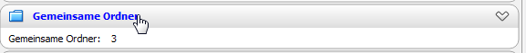
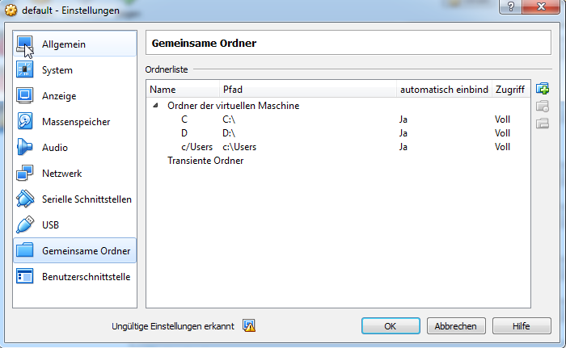

# AMAK Docker Environment

This project aims at providing a docker based development environment for the AMAK project.
If you're not familiar with Docker, take a look at their [Website](https://www.docker.io) or directly
head over to the [Documentation](https://docs.docker.com/) and gain even deeper understanding on how to use it.

## Amaker

### Prepare Environment

1. Install Docker
2. Install Docker Machine
3. Install Boot2Docker (Non Linux Only)
4. Install Docker Compose

### Configure Environment (Non Linux Only)

- Open a shell **please not cmd** and run `docker-machine start default`.
- Run `docker-machine env default` and follow the instructions (run `eval $("docker-machine" env default)`)
  - Please note the ip address from `docker-machine env default`, you will need this in order to update your `host` file.
- Leave the prompt open, you will need it after the following steps again.
- Now we need to configure the filesystem shares.
  - Open Virtual Box and locate the vm `default`.
  - Open the control panel for that vm.
  - Configure the shared folders, **for each used hard drive** from your host system:
    - Create a permanent mount named like following pattern **C** to **C:\\**, **D** to **D:\\**.
    - Please use **uppercase letters** for the share names!
    - 
    - 
  - Close the control panel.
- Go back to your prompt... 
 - Enter the Docker Provider Machine (Boot2Docker) by running `docker-machine ssh default`
    - In that prompt run `sudo su`.
    - Create the file **/var/lib/boot2docker/bootsync.sh** by running 
      `touch /var/lib/boot2docker/bootsync.sh && chmod +x /var/lib/boot2docker/bootsync.sh`
    - Open the file in a editor like `vi /var/lib/boot2docker/bootsync.sh`.
    - Configure your previously defined shares, adapt following example:

```shell
#!/bin/sh
# mount share for host drive C
mkdir /hostc
mount -t vboxsf -o uid=1000,gid=50 C /hostc
# mount share for host drive D
mkdir /hostd
mount -t vboxsf -o uid=1000,gid=50 D /hostd
```

- Execute that file by running `/var/lib/boot2docker/bootsync.sh`, there should be no errors!
- Now run `composer install` inside your `amak-docker` directory.

### Setup Container

- First run `composer install`, followed by `./amaker compose-config`
- now run `./amaker init-frontend` or even `./amaker init-all`. 

## Installation
### 1. Install Docker Toolbox
When using OS X: additionally install [Docker Machine NFS](https://github.com/adlogix/docker-machine-nfs)

### 2. Create a new Docker VM
OS X: Apply NFS-Mount after creation: **docker-machine-nfs**

### 3. Start the environment
```shell
$ cd ~/Workspace/PHP/amak-docker
$ docker-compose up
```

## Usage
### 1. Locate the Container
To access the Container, you first need to get its IP address. Open up a terminal or that ridiculous command line thing
on Windows and type: `docker-machine ip default`.

You later need to bind this IP address with all the projects URLs in your `hosts` file. First of all open that address
in your browser. It should then show you some further instructions on how to proceed with your deployment setup.

### 2. Configure the Deployment
Your browser should be showing a detailed instruction. That document can also be found in the `app/default` directory.
Deploy **amak-frontend** as well as **amak-source** and rebuild the container via `docker-compose up --force-recreate`.

### 3. Database Import
After you set up your deployment, you need to import the database. Start your SQL client of choice and connect to your
container using its ip and **root** for both the username and the password. There is already a **amak** database, that's
been set up to fulfill the requirements for a complete SQL dump.

### 4. Project initialisation
Run those commands inside your IDE to initialise **amak-frontend**. You may need to install that `npm` and `grunt`
gibberish before doing so.
- `$ composer install`
- `$ npm i`
- `$ grunt deploy`

## Access your Container
While most of that stuff will work from outside your container, sometimes it's neccessary to execute commands directly
from within. For instance, you cannot do a database migration from outside, because `yiic` needs the exact configuration
to access the Percona database. Just type in:

`$ docker exec -ti amak-httpd /bin/bash`

The `exec` docker command is used to execute a command on a specific container. The command listed above leads to your
terminal being connected with a `/bin/bash` shell inside the `amak-httpd` container.

Explanation:
- `docker exec` tells Docker to execute something
- `-t` attaches your terminal to the container
- `-i` means "interactive", so that you can use your computer device to type in letters (Keyboard)
- `amak-httpd` is the name of the container
- `/bin/bash` is the command that will be executed within. This one starts an interactive shell

Navigate to `/var/www/amak-frontend` to work with your project files. If you're lazy like me, save some keystrokes by
using:

`$ docker exec -ti amak-httpd /bin/bash -c "cd /var/www/amak-frontend;/bin/bash"`

When you're connected, you can do migrations:

`root@amak-httpd:/var/www/amak-frontend$ php yiic migrate up`


## Things to consider
Since this project will be filled up with **amak-frontend** and **amak-source**, remember to **not add them to the VCS!**
It is hereby recommended to deploy this project locally in order to not let that stuff slip into your workspace.

